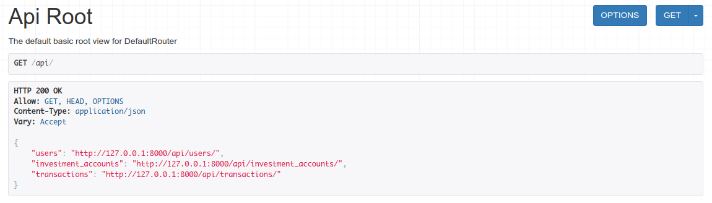
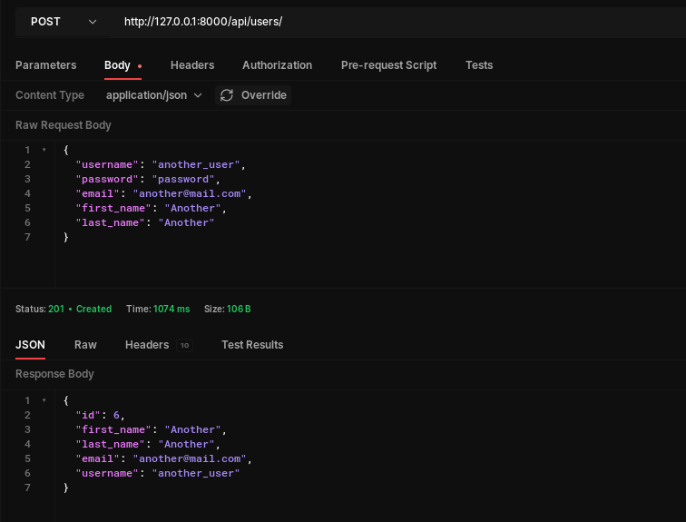
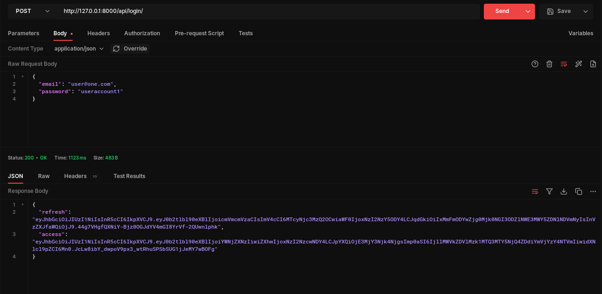

# Actserve Investment App


## Table Of Contents
  - [Local Server Setup](#local-server-setup)
  - [API Endpoints](#api-endpoints)
  - [GitHub Actions](#github-actions)
  - [Project Requirements](#project-requirements)
  - [Authors](#authors)
  - [License](#license)

## Introduction

An app for managing investment accounts.

---

## Local Server Setup

To get started with the local development environment, ensure you have `postgresql` and `python >= 3.10` installed:
```bash
# Tested on Debian Bookworm
$ sudo apt install postgresql python3.11 -y
```

Clone the repository
```bash
# clone with ssh
$ git clone git@github.com:mashm3ll0w/actserve-investment.git

# clone with https
$ https://github.com/mashm3ll0w/actserve-investment.git

# navigate to the cloned directory
$ cd actserve-investment
```

Activate the virtual environment and set up the `.env`

```bash
# create virtual environment
$ python3 -m venv venv

# activate virtual environment
$ source venv/bin/activate

# install dependencies
$ pip install -r requirements.txt

# copy the .env_sample to create the project's .env and populate the DB variables
$ cp .env_sample .env
```

Run the Server

```bash
$ python3 manage.py runserver
```

Run the tests
```bash
$ python3 manage.py test investments.tests
```

## API EndPoints

The api endpoints are:



Create a user:



Login User:



The returned `access` token is used for subsequent requests that require authentication.

Put it in the headers in the format `Authorization: Bearer <access_token>`

e.g 
```bash
$ curl --request GET --url http://127.0.0.1:8000/api/users/ --header 'Authorization: Bearer <access_token>'
```

## GitHub Actions
This project uses GitHub actions to automatically run tests for the app on `push` and `pull requests` to the main branch

The tests can be accessed here - [GitHub Actions](https://github.com/mashm3ll0w/actserve-investment/actions)


## Project Requirements
Create a Django Rest Framework (DRF) API for managing investment accounts that allows more than one user to belong to an investment account it should also allow a user to belong to more than one investment account, with the following requirements:
- [x] User Permissions: Extend the User and Django model permissions so that a user can have multiple investment accounts, each with different levels of access:
- [x] Investment Account 1: The user should only have view rights and should not be able to make transactions.
- [x] Investment Account 2: The user should have full CRUD (Create, Read, Update, Delete) permissions.
- [x] Investment Account 3: The user should only be able to post transactions, but not view them.
- [x] Admin Endpoint: Create an admin endpoint that returns all of a user's transactions, along with a nested sum of the user's total balance. Additionally, this endpoint should include a date range filter to retrieve transactions that occurred within a specified date range.
- [x] Unit Tests: Write unit tests to validate the functionality of the APIs.
- [x] GitHub Action: Set up a GitHub Action to automatically run the unit tests.

## Authors

[@Charles Swaleh](https://github.com/mashm3ll0w)

## License

MIT License